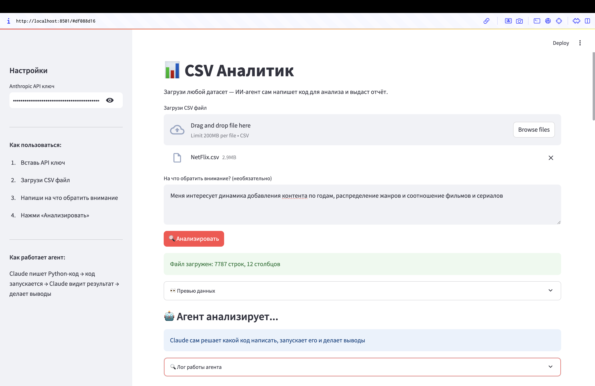
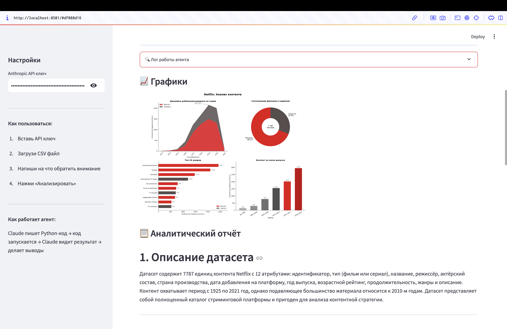
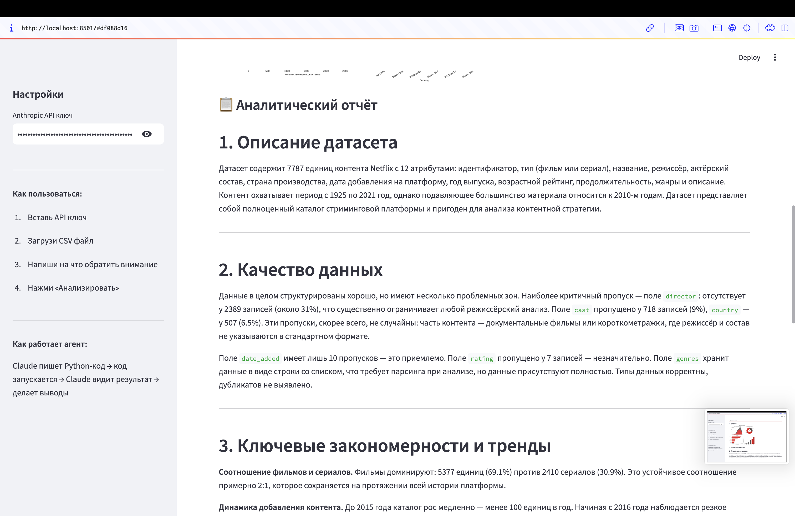
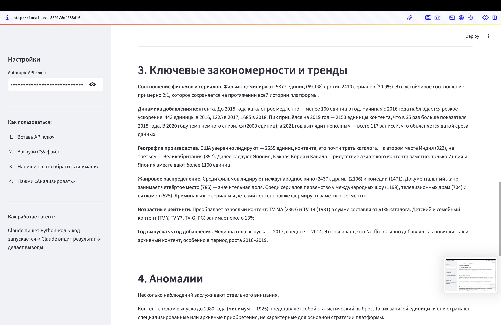
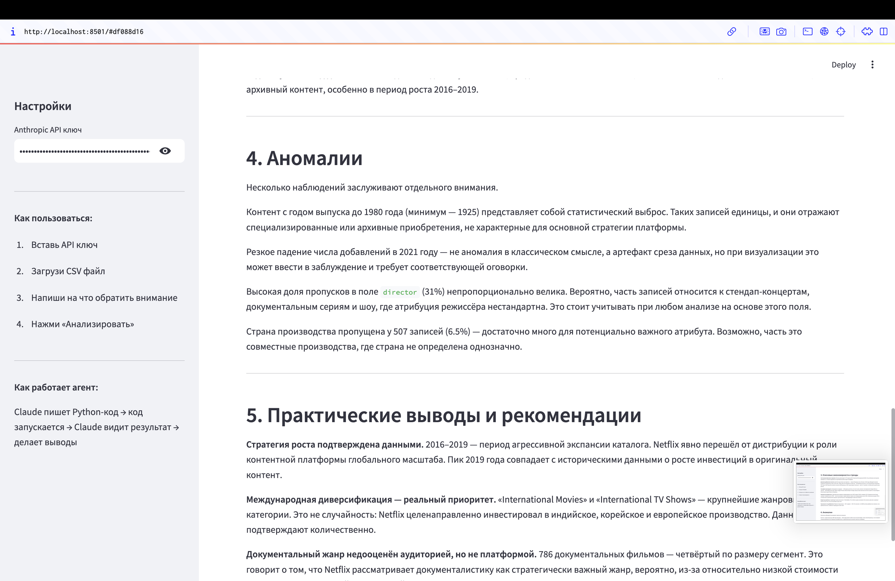
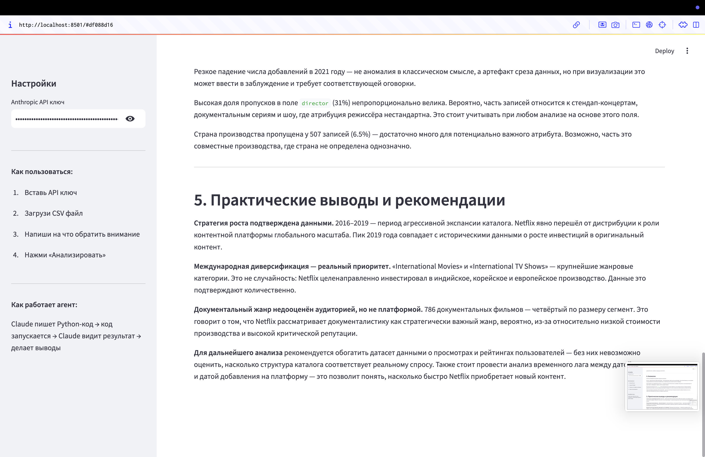

# CSV Аналитик — агентное решение с LLM

Тема: анализ данных с помощью ИИ-агента. Claude сам пишет Python-код, запускает его через инструмент `python`, смотрит на результат и делает аналитические выводы — без заранее заготовленных скриптов.

## Состав
- Веб-интерфейс (Streamlit)
- ИИ-агент (Claude Sonnet через Anthropic API)
- Инструмент выполнения Python-кода (`python` tool)
- Защита от prompt-injection

## Как работает агент
1. Пользователь загружает CSV и (по желанию) пишет на что обратить внимание
2. Claude получает датасет и сам решает какой код написать
3. Код выполняется через инструмент `python` — датасет доступен в переменной `df`
4. Claude видит результат и пишет следующий код
5. После 3 вызовов инструмента Claude пишет финальный текстовый отчёт

Это настоящий агентный цикл: LLM → tool call → результат → LLM → tool call → ... → отчёт.

## Защита от prompt-injection
Пользовательский ввод проверяется регулярными выражениями на попытки переопределить инструкции модели. Подозрительные запросы отклоняются до отправки в LLM.

## Структура проекта
```
csv-analyst/
├── app.py               # основное приложение
├── requirements.txt     # зависимости
├── .gitignore
├── README.md
└── screenshot/          # скриншоты работы приложения
```

## Запуск

1) Установить зависимости:

   `pip install -r requirements.txt`

2) Получить API-ключ (ключ вида `sk-...`).

3) Запустить приложение:

   `streamlit run app.py`

4) Открыть в браузере: `http://localhost:8501`

5) Вставить API-ключ в боковой панели, загрузить CSV и нажать «Анализировать».

## Используемые технологии
- Python 3.12
- Streamlit — веб-интерфейс
- Anthropic SDK — доступ к Claude Sonnet
- pandas, matplotlib, numpy — доступны агенту для анализа данных

## Скриншоты

### Главная страница с загруженным файлом


### Графики построенные агентом


### Аналитический отчёт




